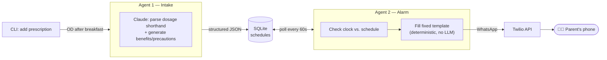

# 🩺 Medicine Reminder

  

A two-agent system that turns a prescription's dosage shorthand — `OD after breakfast`,
`BD`, `TDS` — into a daily schedule, and reminds a parent by WhatsApp when a dose is due,
with a short note on what the medicine does and what to watch out for.

Built for a common, unglamorous problem: adult children track an aging parent's medication
schedule from memory or a sticky note. This automates the reminder, in Hinglish, without
needing the parent to use an app.

## Architecture



- **Agent 1 — Intake Agent** ([intake_agent.py](intake_agent.py)): one Claude call per
  prescription. Parses `OD`/`BD`/`TDS`/`QID`/`HS`/`SOS` and meal-relative phrasing
  ("after breakfast", "before dinner") into concrete daily alert times, and generates a
  short benefits/precautions blurb for the medicine — both in a single structured-output
  call (`output_config.format`, JSON schema), so there's no brittle prompt-then-parse step.
- **Agent 2 — Background Alarm Agent** ([alarm_agent.py](alarm_agent.py)): a daemon thread
  polling the database every 60 seconds. When a schedule matches the current time, it fills
  a fixed message template with values already decided by Agent 1, and sends it via Twilio.
- **Storage** ([db.py](db.py)): SQLite. One row per (parent, medicine, alert time); a
  `last_sent_date` column makes sends idempotent per day.

## Design decisions

**LLM calls are placed where they earn their keep, not everywhere "agentic" could apply.**
Agent 1's job — interpreting freeform shorthand and drawing on general medical knowledge —
is exactly what an LLM is good at, and brittle to hardcode as regex. Agent 2's job —
compare a clock to a database, fill in already-known values, call an API — is mechanical.
An earlier version of this project called Claude at *send* time too, to "generate" the
reminder text; it was reverted to a deterministic template fill once the actual analysis
was done: the LLM was reformatting values that were already fully determined, adding
latency, cost, and a new failure mode for zero change in output. The system now makes
exactly one LLM call per prescription added, and zero at send time.

**Structured outputs over prompt-then-regex.** Both the schedule and the benefits/
precautions blurb come back as schema-validated JSON (`output_config.format`), not parsed
out of free text — no regex, no "hope the model formatted it right."

**Idempotent by construction.** Each schedule row tracks `last_sent_date`; a slow tick or a
process restart can never double-send a reminder for the same day.

## Setup

```bash
python3 -m venv .venv
.venv/bin/pip install -r requirements.txt
cp .env.example .env   # then fill in your real keys
```

| Variable | Where to get it |
|---|---|
| `ANTHROPIC_API_KEY` | [Anthropic Console](https://console.anthropic.com/) → API Keys |
| `TWILIO_ACCOUNT_SID` | [Twilio Console](https://console.twilio.com/) dashboard |
| `TWILIO_AUTH_TOKEN` | Twilio Console dashboard |

`.env` is gitignored — never commit it.

### Twilio WhatsApp sender

`config.py` defaults `TWILIO_WHATSAPP_FROM` to Twilio's shared **WhatsApp Sandbox** number,
which needs no business verification for testing — have the recipient send the sandbox's
join code (Twilio Console → Messaging → Try it out → Send a WhatsApp message) to that number
once. For production sending outside the sandbox, WhatsApp requires a Meta-approved Business
sender and pre-approved Content Templates for any business-initiated message — see
[Twilio's Content API docs](https://www.twilio.com/docs/content) if you're taking this past
a demo.

## Usage

```bash
# Add a prescription — Agent 1 parses the schedule
.venv/bin/python main.py add +91XXXXXXXXXX "Paracetamol" "500mg" "OD after breakfast"

# List all schedules
.venv/bin/python main.py list [+91XXXXXXXXXX]

# Start the background alarm agent (Agent 2) — runs until Ctrl+C
.venv/bin/python main.py run
```

## Example reminder

```
🔔 REMINDER / DAWA KHANE KA SAMAY 🔔
Mummy/Papa, aapki Paracetamol khane ka samay ho gaya hai.
Dosage: 500mg (Nashte ke baad).

ℹ️ Bukhar aur dard kam karne ke liye use hoti hai.
⚠️ Kabhi-kabhi skin par rash ho sakta hai — Doctor se confirm karein.

Kripya dawa khakar mujhe bataiyye!
```

## Limitations & production considerations

- **WhatsApp Business messaging policy**: business-initiated messages (like a proactive
  reminder) require an approved Content Template outside a live 24-hour session with the
  recipient — this is a WhatsApp/Meta platform rule, not specific to this project.
- **Medical info disclaimer**: benefits/precautions text is generated once at intake from
  the model's general knowledge of the named medicine, not a live medical database. It's a
  helpful nudge, not medical advice — always confirm with a doctor or pharmacist.
- **Single-process scheduler**: the alarm agent is one in-process thread; for multi-user
  production use, this would move to a proper job queue (e.g. Celery/APScheduler with a
  durable broker) rather than an in-memory polling loop.

## Possible next steps

- Evaluation harness — automated accuracy checks for Agent 1's dosage parsing and medicine-info generation
- WhatsApp Content Template registration for production, business-initiated sends
- Text-to-Speech layer
- Multi-language support beyond Hinglish
- A lightweight caregiver dashboard (view/edit schedules without the CLI)
- Photo-of-a-prescription intake via vision input, instead of typed dosage text

## License

MIT
